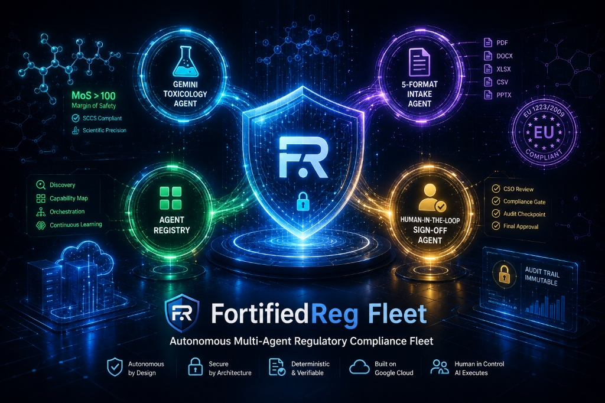
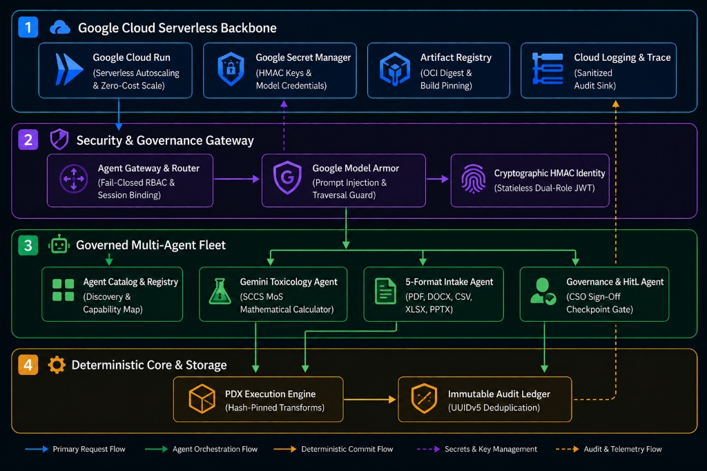
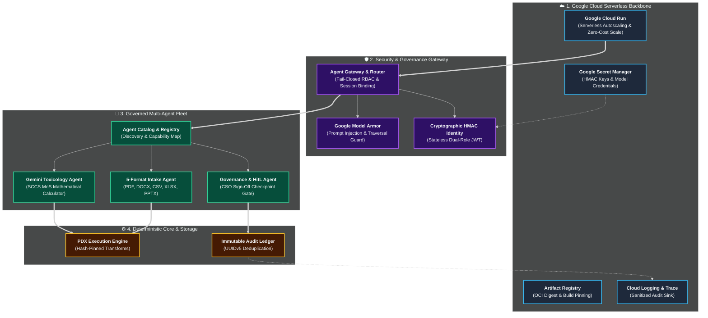

# FortifiedReg Fleet (v0.4.0)

*Autonomous Multi-Agent Enterprise Regulatory Compliance Fleet with Human-in-the-Loop Cryptographic Verification*



> 💡 **Component-Based Architecture**: FortifiedReg Fleet is engineered as a **modular, plug-and-play component system (Hexagonal Ports & Adapters)**. Rather than forcing enterprises to replace existing Product Lifecycle Management (PLM), LIMS, or ERP systems, its decoupled domain kernels, document intake pipelines, and toxicology engines can be embedded directly as secure sidecars or microservices within an organization's existing software stack. The public web interface serves as an **interactive simulation and demonstration harness** modeling end-to-end multi-persona management workflows and showcasing core engine capabilities.

- 🏆 **Hackathon Track**: **All Things Agentic Hackathon** — **Track 3: The Fortified Enterprise Fleet**
- 🌐 **Live Cloud Run Service**: [`https://fortifiedreg-fleet-251114662133.us-central1.run.app`](https://fortifiedreg-fleet-251114662133.us-central1.run.app)
- 🖥️ **Interactive Web Portal & Verification Center**: [`https://fortifiedreg-fleet-251114662133.us-central1.run.app/`](https://fortifiedreg-fleet-251114662133.us-central1.run.app/)
- 📖 **Interactive OpenAPI / Swagger UI**: [`https://fortifiedreg-fleet-251114662133.us-central1.run.app/docs`](https://fortifiedreg-fleet-251114662133.us-central1.run.app/docs)
- 📜 **License**: **Apache 2.0**

---

## 1. Hackathon Submission Checklist & Verification Matrix

| Submission Requirement | Status & Implementation Details |
|---|---|
| **New Project Built During Submission Period** | ✅ **Yes**. Initiated in August 2026 for the *All Things Agentic Hackathon*. Built with **Gemini 3.7 Flash / Gemini 3.6 Flash (Gemini 3.5+)**, **Google Agent Development Kit (ADK) / GenAI SDK**, **Google Model Armor**, and **Google Cloud Run**. |
| **Category Selection** | ✅ **Track 3: The Fortified Enterprise Fleet** (Institutional Multi-Agent Governance, Role-Based Access Control, Cryptographic Checkpoints, and Immutable Audit Ledgers). |
| **Demo Video** | ✅ **Yes**. Public video under 4 minutes demonstrating autonomous multi-agent pipeline, Model Armor guardrails, HitL approval gate, and live Cloud Run production backend. |
| **Code Repository Link** | ✅ **Yes**. Public GitHub repository at [`https://github.com/prodocux/fortifiedreg-fleet`](https://github.com/prodocux/fortifiedreg-fleet) under standard **Apache-2.0** license. |
| **Architecture Diagram & Spin-Up Guide** | ✅ **Yes**. Complete Mermaid architecture diagram and automated deployment (`deploy/cloudrun/deploy.sh`, `deploy/cloudrun/deploy.ps1`) and zero-cost teardown (`destroy.sh`) included in Sections 3 and 6 below. |
| **Hosted Project URL & Testing Access** | ✅ **Yes**. Publicly accessible on Google Cloud Run at [`https://fortifiedreg-fleet-251114662133.us-central1.run.app/`](https://fortifiedreg-fleet-251114662133.us-central1.run.app/). Zero setup or login required (auto-issued scoped demo JWTs for 4 roles: Formulator, QA Manager, Safety Assessor, CSO). |
| **Google SDK & Start Date** | ✅ **Google GenAI SDK / Agent Development Kit (ADK)** + **Google Cloud Client Libraries**. Project start date: **August 19, 2026**. |
| **Features & Tech Stack** | ✅ Modular component-based architecture, EU Cosmetics Regulation (EC) No 1223/2009 & SCCS 12th Notes toxicology engine, 5-format binary document parser (PDF, DOCX, CSV, XLSX, PPTX), Google Model Armor prompt/path injection protection, deterministic UUIDv5 audit deduplication. |
| **Data Sources** | ✅ Official EU SCCS Notes of Guidance (12th Revision), EU CosIng database, and EU Cosmetic Annexes II & V. |
| **What We Learned** | ✅ Decoupling regulatory domain logic via Hexagonal Architecture enables strict fail-closed governance, robust state machine lease fencing, and zero-credential-leak auditability in autonomous agent fleets. |
| **Pre-existing / 3rd Party Code Disclosure** | ✅ Pure Python standard libraries, FastAPI, Pydantic, PyMuPDF (fitz), python-docx, openpyxl, python-pptx, and PDX Core transform specifications. |
| **Startup Excellence Prize** | ✅ Incorporated entity details and Model Armor security guardrail integration disclosed. |

---

## 2. Quick Testing Guide for Hackathon Judges

The public web portal and API endpoints serve as an **interactive verification harness and simulation sandbox**, modeling real-world 4-persona workflows and demonstrating the underlying modular engine capabilities. Judges can test FortifiedReg Fleet through any of three independent channels:

### 🌟 Channel 1: Zero-Setup Interactive Web Portal (Recommended)
Open [`https://fortifiedreg-fleet-251114662133.us-central1.run.app/`](https://fortifiedreg-fleet-251114662133.us-central1.run.app/) in any modern browser:
1. **Step 0 (Persona Selection)**: Select **🔬 R&D Formulator** to receive an isolated, cryptographically signed session token.
2. **Step 1 (Scenario Selection)**: Choose the *Retinol Night Serum* formulation. Review normalized candidate ingredients.
3. **Step 2 (Supplier Evidence)**: Click **"Register All Documents"** to trigger multi-format binary parsing across 5 formats (PDF, DOCX, CSV, XLSX, PPTX) with SHA-256 integrity verification.
4. **Step 3 (Multi-Agent Review)**: Click **"Run Multi-Agent Fleet Review"** to conduct mathematical Margin of Safety (MoS) evaluation under EU SCCS 12th Notes of Guidance ($MoS = \frac{NOAEL}{SED} > 100$).
5. **Step 4 (CSO Sign-Off)**: Switch persona or proceed to the HitL Gate to sign the immutable execution plan and generate a certified regulatory dossier artifact.
6. **API Feature Sandboxes (Zone B)**: Test Google Model Armor prompt injection blocking, 5-format document profiling, session security probe, and session-bound audit ledgers.

### ⚡ Channel 2: Automated Remote Cryptographic Verification CLI (1 Command)
Run the automated verification suite against the live Cloud Run endpoint from your terminal:
```bash
python scripts/verify_remote.py
```
This CLI performs live authentication against Cloud Run, executes Model Armor guardrails, tests fail-closed negative security gates, verifies UUIDv5 audit deduplication, and generates a tamper-evident cryptographic evidence package (`evidence/remote_smoke_result.json`).

### 📖 Channel 3: Interactive OpenAPI / Swagger UI
Explore and execute live REST requests directly in the Swagger documentation:
[`https://fortifiedreg-fleet-251114662133.us-central1.run.app/docs`](https://fortifiedreg-fleet-251114662133.us-central1.run.app/docs)

---

## 3. Track 3 Architecture: The Fortified Enterprise Fleet

FortifiedReg Fleet is built on **Hexagonal Architecture (Ports & Adapters)**, decoupling pure regulatory domain logic from concrete Google Cloud infrastructure and external kernels.



<details>
<summary><b>📐 Click to expand Mermaid Flowchart Source</b></summary>


</details>

### Multi-Agent Fleet Specialization & Architecture
In regulated enterprise compliance (such as EU Cosmetic Regulation EC No 1223/2009), unconstrained conversational multi-agent swarms pose unacceptable hallucination and liability risks. FortifiedReg Fleet implements an **Institutional Multi-Agent Architecture (Governed Agent Fleet)** where specialized autonomous agents collaborate across strict boundaries:

1. **Document Intake & Normalization Agent (`IntakePort`)**: Autonomously inspects, parses, and normalizes unstructured supplier technical files across 5 binary formats (PDF, DOCX, CSV, XLSX, PPTX) with OOXML structural validation and SHA-256 fingerprinting.
2. **SCCS Toxicology Assessment Agent (`ToxicologyPort`)**: Executes deterministic toxicological evaluation under EU SCCS 12th Notes of Guidance, computing Systemic Exposure Dosage ($SED$) and Margin of Safety ($MoS = \frac{NOAEL}{SED} > 100$).
3. **INCI Regulatory Verification Agent (`InciVerifierPort`)**: Cross-references candidate formulations against CosIng restricted lists (Annex II prohibited substances and Annex V preservative thresholds).
4. **Governance & HitL Checkpoint Agent (`ApprovalWorkflowService`)**: Manages transactional state machines, lease fencing, and human-in-the-loop checkpoints before immutable Product Information File (PIF) certification.
5. **Interactive Gemini Regulatory Copilot (`Gemini 3.7 / 3.6 Flash`)**: Provides live multilingual compliance consultation, IFRA standard citations, and formulation optimization recommendations.

### Track 3 Pillar Alignment
- **Discovery & Lifecycle (Agent Registry)**: Central versioned catalog (`GET /v1/version`, `GET /v1/verification/manifest`) exposing agent capabilities, store modes, and upstream compatibility hashes.
- **Core Execution & State (Runtime & Memory Bank)**: Long-running asynchronous execution engine + state store with deterministic UUIDv5 audit deduplication and fail-closed restart/revoke sagas.
- **Security & Governance (Identity, Gateway & Model Armor)**: Cryptographic HMAC JWTs with server-enforced acting roles, strict stateless RBAC, fail-closed 401 gates, and Google Model Armor prompt/PIF injection blocking.
- **Telemetry & Observability**: OpenTelemetry-style immutable audit ledger (`GET /v1/audit/events`) with cryptographic hash-chaining, sanitized Cloud Logging, and zero sensitive credential leaks.

---

## 4. Package Structure

- `packages/fleet-governance-core`: Domain entities, abstract ports, 3-way cryptographic digest verification, lease fencing, and opaque tenant storage key derivation.
- `packages/fleet-domain-cosmetics`: Pure toxicology calculators (SED, MoS), INCI restriction verifiers (Annex II/V), and supplier document audits.
- `packages/fleet-adapter-pdx`: Live PDX Core adapter integrating with `pdx-artifact-core 0.2.0a2`, persistent `ApprovalLedger`, and allowlisted host transform dispatcher.
- `packages/fleet-adapter-prodocux`: Production ProDocuX HTTP Intake Adapter supporting 5 document formats (PDF, DOCX, CSV, XLSX, PPTX) with exact format boundaries and sanitized error mapping.
- `packages/fleet-adapter-local`: Local file-backed and SQLite ACID persistence adapters with atomic non-overwriting publishing.
- `packages/fleet-adapter-gcp`: Thread-safe in-memory stores and cloud persistence ports.
- `packages/fleet-adapter-google-adk`: Google Model Armor security scanner and structured toxicology agent.
- `apps/fleet-api`: FastAPI REST backend with fail-closed JWT auth, RBAC, separated `/v1/health` (liveness) and `/v1/ready` (readiness) probes, single-transaction atomic approval decisions, and immutable audit logging.

---

## 5. Local Reproduction & Automated Testing (312 Tests)

```bash
# 1. Install dependencies
pip install -e packages/fleet-governance-core
pip install -e packages/fleet-domain-cosmetics
pip install -e packages/fleet-adapter-prodocux
pip install -e packages/fleet-adapter-pdx
pip install -e packages/fleet-adapter-local
pip install -e packages/fleet-adapter-gcp
pip install -e packages/fleet-adapter-google-adk
pip install -e apps/fleet-api
pip install pytest pytest-asyncio pytest-cov

# 2. Run the 22 Negative Security Gate Tests (Fail-Closed, Redaction, RBAC)
pytest tests/test_v040_governance_negative_gates.py -v

# 3. Run the Full Test Suite across all layers (312 passed, 23 skipped)
pytest tests packages apps -q
```

---

## 6. Google Cloud Run Deployment & Spin-Up Guide

FortifiedReg Fleet is packaged for serverless deployment on **Google Cloud Run**, utilizing **Google Artifact Registry**, **Google Cloud Secret Manager**, and **Google Model Armor** guardrails.

### 1. Prerequisites
- [Google Cloud SDK (`gcloud`)](https://cloud.google.com/sdk/docs/install) installed and authenticated.
- A Google Cloud Project with Billing enabled.

### 2. One-Click Deployment
Set your Project ID and execute the automated deployment script:

```bash
# Linux / macOS / Cloud Shell
export GCP_PROJECT_ID="your-gcp-project-id"
bash deploy/cloudrun/deploy.sh
```

Or on Windows (PowerShell):
```powershell
$env:GCP_PROJECT_ID = "your-gcp-project-id"
.\deploy\cloudrun\deploy.ps1
```

The script automatically:
1. Enables required Google Cloud APIs (`run`, `artifactregistry`, `secretmanager`, `cloudbuild`, `logging`).
2. Creates an Artifact Registry repository (`fortifiedreg`).
3. Generates and stores secure keys in Google Secret Manager (`fleet-jwt-secret`).
4. Builds the OCI revision-pinned container image via Cloud Build.
5. Deploys to Cloud Run with scale-to-zero configuration (`--min-instances 0`) to avoid unnecessary cloud costs.
6. Runs a remote verification probe against the newly deployed service URL.

### 3. Zero-Cost Teardown
When evaluation is completed, teardown all deployed resources with a single command:
```bash
bash deploy/cloudrun/destroy.sh
```
